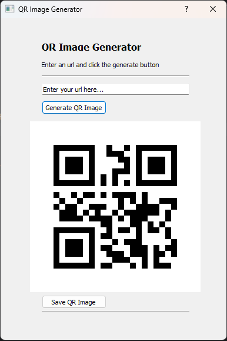

 

  

  <h3 align="center">Generator for QR images</h3>

  

    <a href="https://github.com/bwvanlith/Python_QRGenerator/issues">Report Bug</a>
    .
    <a href="https://github.com/bwvanlith/Python_QRGenerator/issues">Request Feature</a>
  

    

## Table Of Contents

* [About the Project](#about-the-project)
* [Built With](#built-with)
* [Getting Started](#getting-started)
  * [Prerequisites](#prerequisites)
  * [Installation](#installation)
* [Usage](#usage)
* [Contributing](#contributing)
* [License](#license)
* [Authors](#authors)
* [Acknowledgements](#acknowledgements)

## About The Project

This is a project that is still under development and missing a lot of features. Currently it works as follows:

* Start either one of three python variations (command line, tkinter Gui or PyQt5 Gui)
* Enter your url or other info and press Generate QR Image
* Click the save button to save it in the same folder :smile:

In the near future I'll add the following features plus whatever requests are expressed:
* SVG support
* General file extension support (png, jpg, jpeg, etc)
* file save location
* dimension settings

A list of commonly used resources that I find helpful are listed in the acknowledgements.

## Built With

Python with QR module

### Prerequisites

Dependencies are PyQt5, tkinter and QR, depending on the version you use.

## Contributing

Contributions are what make the open source community such an amazing place to be learn, inspire, and create. Any contributions you make are **greatly appreciated**.
* If you have suggestions for adding or removing projects, feel free to [open an issue](https://github.com/bwvanlith/Python_QRGenerator/issues/new) to discuss it, or directly create a pull request after you edit the *README.md* file with necessary changes.
* Please make sure you check your spelling and grammar.
* Create individual PR for each suggestion.
* Please also read through the [Code Of Conduct](https://github.com/bwvanlith/Python_QRGenerator/blob/main/CODE_OF_CONDUCT.md) before posting your first idea as well.

### Creating A Pull Request

1. Fork the Project
2. Create your Feature Branch (`git checkout -b feature/AmazingFeature`)
3. Commit your Changes (`git commit -m 'Add some AmazingFeature'`)
4. Push to the Branch (`git push origin feature/AmazingFeature`)
5. Open a Pull Request

## License

Distributed under the MIT License. See [LICENSE](https://github.com/bwvanlith/Python_QRGenerator/blob/main/LICENSE.md) for more information.

## Authors

* **Bart-Willem van Lith** - ** - [Bart-Willem van Lith](https://github.com/bwvanlith) - *Project author*

